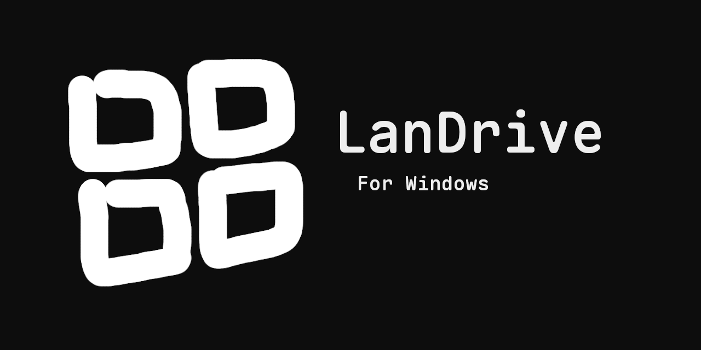
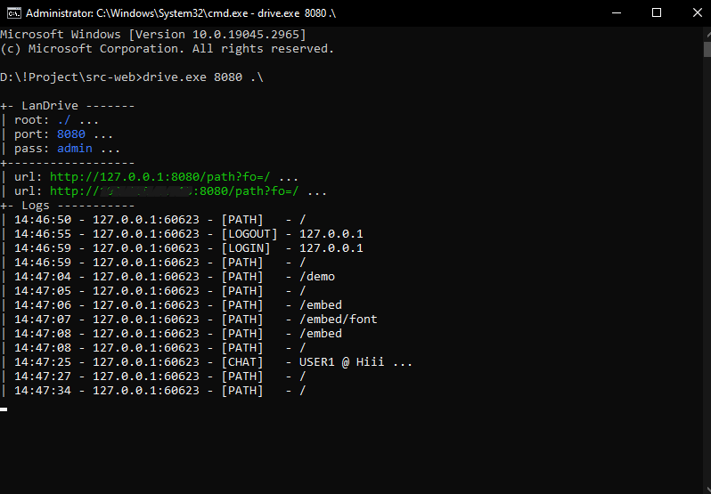
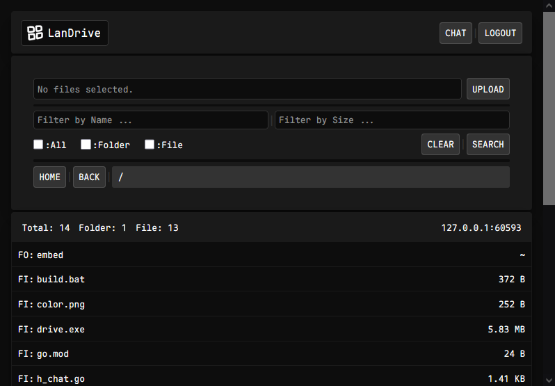
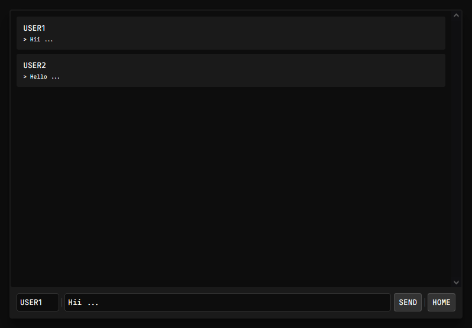

# LanDrive

📁 **LanDrive** is a fast, lightweight, and portable HTTP file server for Windows.


## Features:
- **Portable** – single `.exe` file, no installation required.
- **Zero dependencies** – no third-party libraries used.
- **Multi-file upload** – upload several files at once.
- **Direct streaming** – files are streamed directly to disk (low memory usage).
- **IP-based authentication** – fast and effective for most LAN setups.
- **Scalable directory listing** – efficiently lists `>5000` files/folders in C (low latency & CPU usage).
- **Built-in LAN chat** – quickly share links or text with all LAN users.

## Demo:
- **Command Prompt Logging:** 

- **Client Login Interface:** 

- **Main server Interface:** 

- **Server Chat Interface:** 


## Usage:
- Run:
    ```sh
    > drive.exe [port] [pin/pass] [root]
    ```
- Example:
    ```sh
    > drive.exe 80 abc123 C:\server-root-path\
    ```
- Output:
    ```sh
    +- LanDrive -------
    | root: C:\server-root-path\ ...
    | port: 80 ...
    | pass: abc123 ...
    +------------------
    | url: http://127.0.0.1:80/path?fo=/ ...
    | url: http://192.168.0.200:80/path?fo=/ ...
    +- Logs -----------
    ```
    ✅ Now you’re ready to go! Open the above URLs in your browser.

## Build:
- **Install Dependencies:**
    - Download and install [MSYS2](https://www.msys2.org/).
    - Open the **mingw64.exe** shell (from the MSYS2 Start Menu).
    - Run the following commands:
        ```sh
        $ pacman -Syu        # Update system packages (MSYS2 may restart)
        $ pacman -Syu        # Run again after restart
        $ pacman -S --needed base-devel mingw-w64-x86_64-toolchain
        $ pacman -S mingw-w64-x86_64-go
        ```

- **Set Environment Variables:**
    - Open the **Environment Variables**:
        ```sh
        > rundll32.exe sysdm.cpl,EditEnvironmentVariables   # run in Command Prompt
        ```
    - Add the following paths to your **Path** variable:
        ```
        C:\msys64\mingw64\bin\
        C:\msys64\usr\bin\
        ```

- **Verify Installation:**
    - Run these commands to confirm:
        ```
        > gcc --version
        > g++ --version
        > go version
        ```
    - If you see version output, your installation was successful 👍

- **Build the Project:**
    - Just run `build.bat`
    - The file `drive.exe` will appear inside the Source folder.

## Project Structure:
The project has the following structure:

```
.
│
├── build.bat
├── color.png
├── go.mod
├── html.go
├── h_chat.go
├── h_get.go
├── h_login.go
├── h_path.go
├── h_set.go
├── icon.ico
├── icon.rc
├── LICENSE
├── main.go
├── README.md
├── banner.png
│
├─── demo
│      ├── pic_1.png
│      ├── pic_2.png
│      ├── pic_3.png
│      └── pic_4.png
│
└─── embed
    │   ├── ansi.c
    │   ├── chat.js
    │   ├── login.js
    │   ├── main.c
    │   ├── main.css
    │   ├── main.js
    │   └── main.png
    │
    └─── font
            ├── CourierPrime-Bold.ttf
            ├── CourierPrime-BoldItalic.ttf
            ├── CourierPrime-Italic.ttf
            ├── CourierPrime-Regular.ttf
            └── OFL.txt
```
## Contributing:

Feel free to contribute to this project by submitting pull requests or reporting issues. Your contributions are greatly appreciated!

## License:

This project is licensed under the [MIT License](LICENSE).

😄 Happy coding!
