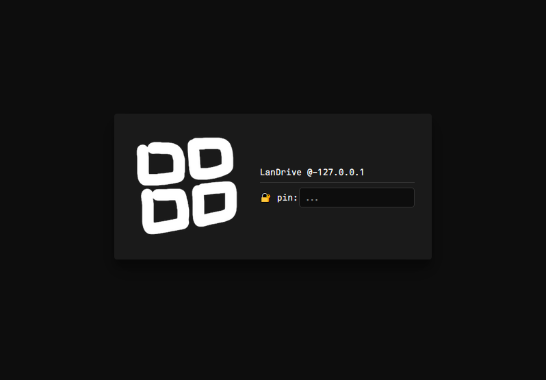

# LanDrive

📁 **LanDrive** is a fast, lightweight, and portable HTTP file server for Windows.

### Features:
- **Portable** – single `.exe` file, no installation required.
- **Zero dependencies** – no third-party libraries used.
- **Multi-file upload** – upload multiple files simultaneously.
- **Direct streaming** – files are streamed directly to SSD/HDD (low memory usage).
- **IP-based authentication** – fast and effective for most LAN setups.
- **Scalable directory listing** – efficiently lists >5000 files/folders in C (low latency & CPU usage).
- **Built-in LAN chat** – quickly share links or text with all LAN users.
### Demo:
- **Command Promt Loging**

- **Clint Login Page**

- **Main server Interface**

- **Server Chat Interface**


### Usage:
- Run:
    ```sh
    > drive.exe [port] [pin/pass] [root]
    ```
- Example:
    ```sh
    > drive.exe 80 abc123 C:\server-root-path\
    ```
- Output:
    ```sh
    +- LanDrive -------
    | root: C:\server-root-path\ ...
    | port: 80 ...
    | pass: abc123 ...
    +------------------
    | url: http://127.0.0.1:80/path?fo=/ ...
    | url: http://192.168.0.200:80/path?fo=/ ...
    +- Logs -----------
    ```
    ✅ Now you’re ready to go!
